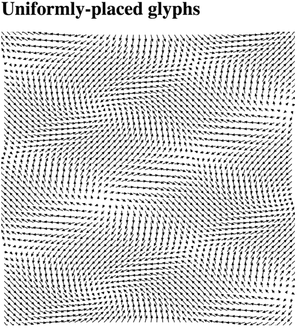

# 2D Vector fields

- Posting date: Nov 15th
- Due date: Nov 22th
- Assignment name for `turnin`: `cs444_assignment_10`

In this assignment, you will implement some techniques for
visualizing vector fields. Specifically, you will implement three
techniques based on glyph drawing, and one technique based on
colormapping. For this assignment, we will be using synthetic data,
because of its simplicity.

As usual, you will build on skeleton code we provide.

# Data

The data is provided in one array: `data`. This array contains objects
which look like this:

    {
        "vx": x-component-of-vector,
        "vy": y-component-of-vector, 
        "Col": 0, 
        "Row": 0
    }

## Part 1: Colormap rectangles based on vector magnitude (20 points)

Implement a colormap that will show the different magnitudes of the
vectors in the field using filled rectangles, one per cell. Use an
appropriate colormap.

## Part 2: Hedgehog Plots (30 points)

Implement code to draw a hedgehog plot: a plot that shows arrows by
drawing lines starting at the vector origin, pointing in the direction
of the arrow, with length proportional to the vector's magnitude.

The solution will look somewhat like this:

## Part 3: Uniformly-placed Arrow glyphs (30 points)

Implement code to draw arrow glyphs such that arrows start at the
center of each cell, have lengths proportional to the magnitude of the
vector field, and point in the right direction. Use the SVG `path`
element for this.

**Hint 1**: It's easier to draw the arrow pointing in one fixed
  direction, and then rotate the entire arrow using the appropriate
  SVG commands. You will also likely want to use
  [`Math.atan2`](https://developer.mozilla.org/en-US/docs/Web/JavaScript/Reference/Global_Objects/Math/atan2).

**Hint 2**: SVG transform attributes can have more than one
instruction. See the example "Rotating and translating and SVG
element"
[in the MDN documention](https://developer.mozilla.org/en-US/docs/Web/SVG/Attribute/transform).

The solution will look somewhat like this:

## Part 4: Randomly-placed Arrow glyphs (30 points)

Implement code to draw arrow glyphs like above, but instead of being
placed at the center of the cell, the arrows are randomly placed
inside each cell. 

The solution will look somewhat like this:

# Files

- [main.js](assignment_10/main.js) is the skeleton you will build on
  (implement the functions commented with "write this"),
- [index.html](assignment_10/index.html) has the HTML you'll need, and
- [data.js](assignment_10/data.js) has the data you will use.
