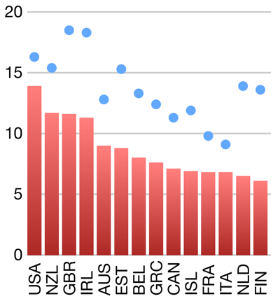

# Course Review

- Posting date: Nov 29th
- Due date: Dec 12th
- Assignment name for `turnin`: `cs444_assignment_11`

In this assignment, you will answer a sequence of questions that
covers the entirety of the contents of this course. Note that you have
two weeks to finish this assignment.

You will submit a single **plain-text** file called `answers.txt`. The
first line of your submission will have your name, and will be
followed by a blank line. Each of your answers will start with `1. `,
`2. `, etc. and will end with a blank line. For questions with
subproblems, use `5a. `, `5b. `, etc. Here's an example if I were
submitting the assignment:

    Carlos Scheidegger
	
    1. This is the answer to the first question. It has some more
    text.
	
	2. This is another answer.
	
    3. d
	
	4. This is a bad visualization because XYZ.
	
	5a. True.
    
    5b. False.
	
	5c. True.
	
	...

Answer each question using no more than 50 words. Each question is
worth 5 points (for a total of 105 points).

## Questions

1. 1. Write a CSS selector for all elements of class `node`.

   2. Write a CSS selector for all `circle` elements.
   
   3. Write a CSS selector the element with ID `main`.

2. 1. Write a JavaScript object with property names `country`
   and `GDP`, and property values `"US"` and `16.77`.
   
   2. Write a JavaScript array of all positive odd integers less than 10.
   
   3. What's the purpose of the `this` keyword in JavaScript?

3. 1. Write an SVG `line` element that goes from point `(0, 0)` to
      `(200, 200)` and is drawn in blue.

   2. **Without using d3**, write a JavaScript snippet  to create a `div`
       element, store it in the global variable `element`, set its CSS
       class to `title`, and its content to `This is a title`.
	   
4. 1. Write a `d3` expression that selects the element with id `main`,
      appends an `svg` element, and sets its width and height to 300.

   2. Write a single `d3` expression that appends a `rect` element for
      each value in the global variable `data` (which holds a
      JavaScript array), and binds each `rect` element to each item of
      `data`.

5. 1. You have a variable `scale` that was initialized as follows:

          scale = d3.scaleLinear().domain([0, 10]).range([200, 300])
	  
      What's the result of `scale(3)`, `scale(5)`, `scale(10)`, and `scale(15)`?
   
   2. You have a variable scale that was initialized as follows:
   
          scale = d3.scaleLinear()
		      .domain([0, 10])
			  .range(["translate(0, 200)", "translate(200, 0)"])
   
      What's the result of `scale(5)`, `scale(-5)`, and `scale(20)`?
	  
6. 1. How do human eyes distinguish between different colors?

   2. What's the most common form of color vision deficiency?

7. Which of the following color spaces is more appropriate for
   designing a color picker user-interface widget in a visualization,
   and why? (a) RGB (b) CMYK (c) HSV (d) Lab

8. Which of the following visual channels should you use in a colormap
   for categorical data, and why? (a) Hue (b) Saturation (c) Luminance

9. What's the difference between **separable** and **integral**
   visual channel pairs?

10. Which property of the human visual system do treemaps take
    advantage of?
	
11. What are the three main ideas one should keep in mind when
    designing **interactive** visualization programs?

12. Describe two ways in which the following visualization is not
    effective:
	
	

13. What is the fundamental reason to plot data in a logarithmic
    scale?

14. The typical practice in visualization is to fix the width and
    height of the plot ahead of time. When plotting time series,
    describe why fixing the widths and heights of the plot might be
    ineffective.

15. Give two advantages (or two disadvantages) for choosing
    Scatterplot Matrices over Parallel Coordinate Plots.
	
16. When should you use the general technique of Multidimensional
    Scaling?

17. Describe the main forces in the standard force-directed layout of
    undirected graphs.

18. When are matrix diagrams sometimes better than node-link diagrams?
    When are they not?
	
19. The Marching Pentagons algorithm is the variant of Marching
    Squares where each cell is a **pentagon** instead of a square. If
    we count each case separately regardless of rotational or polarity
    symmetries, how many cases are there? If we **do** regard all
    symmetries as the same, how many cases are there, and more
    specifically, how many of each cases have zero, one, or two
    distinct line segments?

20. What's the main disadvantage of plotting vector fields using a
    hedhehog plot?

21. 1. If a map projection preserves area, what can we say about its
    Tissot's indicatrices?
	
	2. If a map projection preserves shape, what can we say about its
	Tissot's indicatrices?
