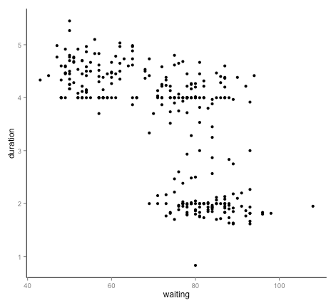

# Assignment 2

- Posting date: Aug. 30th 2017
- Due date: Sep. 6th 2017, 11:59PM MST.
- Submission: [GitHub classroom](https://classroom.github.com/a/rI-3IaiW).

# Description

In this assignment you will first create a simple webpage with some
graphical content, using HTML, CSS, and SVG. These are basic building
blocks that we will later manipulate using `d3` in order to create
visualizations. As such, it is important that you know how the pieces
work on their own, before moving forward.

After that, you will use the SVG creation functions we developed in
the previous lecture to design a simple visualization for a
dataset.

Your repository will consist of two webpages: `part1.html` and
`part2.html`.

**IMPORTANT NOTE**. For this assignment, you are NOT allowed to use
any source code other than the files we provide in links from this
document. **Do not** use d3, underscore, lodash, or other helper
libraries.

### Provided source code

For `part1.html`, I actually want you to write the SVG elements by hand.
For `part2.html`, you can use the JavaScript functions in the
[svg.js](svg.js) source file. These are the functions we
developed in class to create SVG elements, together with a helper
function for you to create RGB triplets (in order to give your
visualization data-driven colors)

## Part 1: create simple charts using SVG

The first webpage you create, `part1.html`, will have five simple
charts: two bar charts, two line charts and one pie chart (this is
possibly the last time I'll ask you to draw a pie chart in earnest:
we'll see why in the Principles part of the course).

You will draw each chart in an SVG element of size 400x400. The
elements for each SVG chart need to have specific `id` elements:

- bar chart with blue bars: `blue_bar_chart`
- bar chart with red bars: `red_bar_chart`
- line chart with line elements: `line_line_chart`
- line chart with path element: `path_line_chart`
- pie chart: `pie_chart`

### Bar charts

Your bar charts should take all horizontal space in the SVG (all 400
pixels). The individual bars should have the following height, in order: `150,
225, 225, 300, 300, 225, 225, 150`.

You should create a bar chart with blue bars in the SVG element named
`blue_bar_chart`, and a bar chart with red bars in the SVG element
named `red_bar_chart`. *In addition*, the SVG elements inside each of
the main elements should be *IDENTICAL*. In other words: any
declarations that will influence the color of the bars need to be done
with the attributes of the different outer SVG elements and your CSS
declarations. It is important that you learn how to do this kind of
thing because it will enable you, later on, to write better
abstractions in d3. Better abstractions mean you can try more things
faster. Trying more things, as we discussed, means you eventually end up
with better visualizations.

The bar charts will look like this:

### Line charts

Your two line charts will look almost identical. The first line chart,
with id `line_line_chart`, will be composed of SVG `line`
elements. The second line chart, with id `path_line_chart`, will be composed of a single `path`
element that will draw the polyline. The heights of the vertices in
the polyline should be the same as the heights of the individual bars
for your bar charts.

Both of your line charts will look very similar to this:

### Pie Chart

Your pie chart, which will be an SVG element with id `pie_chart`, will
have two wedges. The first wedge will span 90 degrees and will be
red, and the second wedge will span the remaining 270 degrees, and
will be yellow.

Your pie chart will look very similar to this:

### Assessment for Part 1 (50% of total grade)

- 10% of the grade will be given to submissions which succesfully
  validate as HTML5 according to the
  [w3c validator](http://validator.w3.org/check).
  
- 8% of the grade will be given to submissions for each chart that
  gets full marks. The charts don't have to look *exactly* like the
  ones here, but the general style should match: fill and stroke
  colors count, as do positioning of the elements, and respecting the
  constraints of the assignments (using the right elements and right
  declarations, as described above).

## Part 2: create a visualization by emitting SVG programmatically

The second HTML file you will submit will be named `part2.html`. It
can reference other files as you may choose (such as CSS and
JavaScript files), but in that case, **make sure these are pushed to
GitHub as well**. Each visualization
in this file should be an SVG element of 500 pixels in both width and height. The
`id` of the element containing the first visualization should be
"scatterplot_1", the `id` of the element containing the second
visualizations should be "scatterplot_2", the `id` of the element and so on.

### Dataset: ACT, GPA, SAT, oh my

This dataset ([ref](http://www.calvin.edu/~stob/data/)) contains
standardized scores for all Calvin College 2004 seniors that have
taken both the ACT and the SAT, together with their GPAs. There are
271 data points and 4 dimensions.

For your convenience, I have processed the original csv file into a
[Javascript source file](scores.js) that you can include directly in your submission.
The dataset looks like this:

    var scores = [
     { SATM:430, SATV:470, ACT:15, GPA: 2.239 },
     { SATM:560, SATV:350, ACT:16, GPA: 2.488 },
     { SATM:400, SATV:330, ACT:17, GPA: 2.982 },
     { SATM:410, SATV:450, ACT:17, GPA: 2.155 },
    ... 263 more rows ...
     { SATM:700, SATV:680, ACT:35, GPA: 3.911 },
     { SATM:720, SATV:770, ACT:35, GPA: 3.981 },
     { SATM:750, SATV:730, ACT:35, GPA: 3.882 },
     { SATM:790, SATV:780, ACT:35, GPA: 3.887 }
    ];

### Visualization 1 (20% credit)

Create a [scatterplot](http://en.wikipedia.org/wiki/Scatter_plot) of
SAT's mathematics scores (`SATM` column) versus SAT's verbal scores
(`SATV` column), using circles as the marks for the data points.  In
other words, the x coordinate of the plot should encode the `SATM`
variable, and the y coordinate should encode `SATV`. Use radius to
represent ACT scores, and color to represent the GPA scores.

### Visualization 2 (15% credit)

Create a different scatterplot, now showing the relationship between:

* ACT scores (`ACT` column) on the x axis, 
* GPA scores (`GPA` column) on the y axes,
* the radius of the dots to represent `SATM` scores, and
* color to represent `SATV`.

### Visualization 3 (15% credit)

Create yet another scatterplot:

* the sum of the SAT scores on the x axis,
* GPA on the y axis,
* color to represent ACT

### Extra credit: axis annotations (+10%)

Add axis lines, labels and tick marks to the X and Y axes of your
visualizations. In other words, to get this extra credit, instead of
looking like this:

your plots should look like this:

Of course, the dataset I just used in the example above is not the
same as the one you have, so the values for the tick marks, labels,
etc. should all be different.

Some things you will need to consider:

* margins for your axes, tick marks, and axis labels
* try to pick good values for the tick marks, and a good number of
  them: not too many, and not too few.
