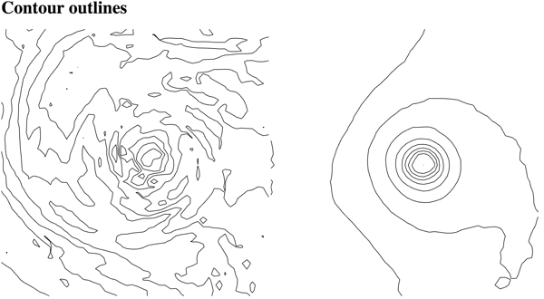
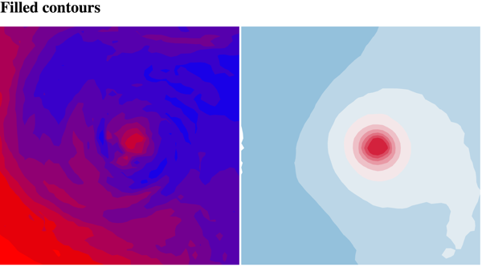

# Assignment 7

- Posting date: Nov 1st
- Due date: Nov 8th
- GitHub [classroom link](https://classroom.github.com/a/v8Oi8l-s)

# Description

In this assignment, you will implement **Marching Squares**, one
algorithm for generating contours of a 2D scalar field.  We will use
the same data as in [assignment 4](../assignment_4/), the dataset
with temperature and pressure measurements for a simulation of
Hurricane Isabel. As usual, you will build on skeleton code we
provide.

# Data

The data is provided in two arrays: `temperatureCells` and
`pressureCells`. Each array contains objects that look like this:

    {
        NW: value-at-nw-corner,
        NE: value-at-ne-corner,
        SW: value-at-sw-corner,
        SE: value-at-se-corner,
        Row: i,
        Col: j
    }

## Part 1: Implement the computation of outlines contours (50 points)

Implement the computation of **outline contours** using marching squares
by filling out the skeleton code, specifically the function
`generateOutlineContour`. As in assignment 4, each square is 10x10
pixels.

The solution will look like this:

## Part 2: Implement the computation of filled contours (50 points)

Implement the computation of **filled contours** using marching
squares by filling out the skeleton code, specifically the functions
`generateFilledContour` and `includesFilledContour`. As in assignment
4, each square is 10x10 pixels.

The solution will look somewhat like this:

# Files

- [main.js](files/main.js) is the skeleton you will build on
  (implement the functions commented with "write this"),
- [index.html](files/index.html) has the HTML you'll need, and
- [data.js](files/data.js) has the data you will use. **Note
  that this is a different file from assignment 4, because
  the data is structured differently**.
