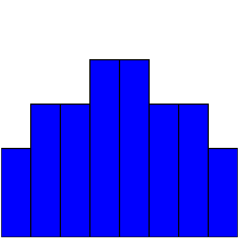
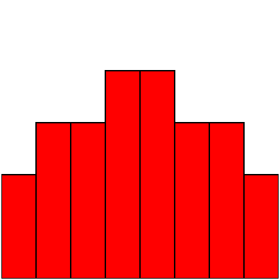
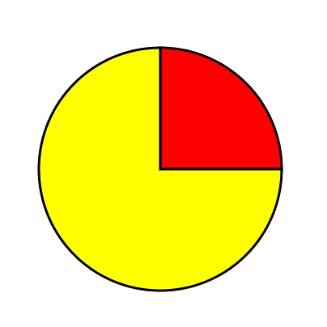

# Assignment 2

- Posting date: Jan. 22nd 2015
- Due date: Jan 29th 2015, 1:59PM MST. (it is due *by thursday's
  lecture*)
- Assignment name for `turnin`: `cs444_assignment_2`

# Description

In this assignment you will create a simple webpage with some
graphical content, using HTML, CSS, and SVG. These are basic
building blocks that we will manipulate in later projects using
Javascript and d3 in order to create visualizations. As such, it is
important that you know how the pieces work on their own, before
moving forward.

## Assignment: create simple charts using SVG

The webpage you create will have five simple charts: two bar charts,
two line charts and one pie chart (this is possibly the last time I'll
ask you to draw a pie chart in earnest: we'll see why in the
Principles part of the course).

You will draw each chart in an SVG element of size 400x400. The
elements for each SVG chart need to have specific `id` elements:

- bar chart with blue bars: `blue_bar_chart`
- bar chart with red bars: `red_bar_chart`
- line chart with line elements: `line_line_chart`
- line chart with path element: `path_line_chart`
- pie chart: `pie_chart`

The name of the file should be `index.html`.

## Bar charts

Your bar charts should take all horizontal space in the SVG (all 400
pixels). The individual bars should have the following height, in order: `150,
225, 225, 300, 300, 225, 225, 150`.

You should create a bar chart with blue bars in the SVG element named
`blue_bar_chart`, and a bar chart with red bars in the SVG element
named `red_bar_chart`. *In addition*, the SVG elements inside each of
the main elements should be *IDENTICAL*. In other words: any
declarations that will influence the color of the bars need to be done
with the attributes of the different outer SVG elements and your CSS
declarations. It is important that you learn how to do this kind of
thing because it will enable you, later on, to write better
abstractions in d3. Better abstractions mean you can try more things
faster. Trying more things, as we discussed, means you will end up
with better visualizations.

The bar charts will look like this:

## Line charts

Your two line charts will look almost identical. The first line chart,
with id `line_line_chart`, will be composed of SVG `line`
elements. The second line chart, with id `path_line_chart`, will be composed of a single `path`
element that will draw the polyline. The heights of the vertices in
the polyline should be the same as the heights of the individual bars
for your bar charts.

Both of your line charts will look very similar to this:

## Pie Chart

Your pie chart, which will be an SVG element with id `pie_chart`, will
have two wedges. The first wedge will span 90 degrees and will be
red, and the second wedge will span the remaining 270 degrees, and
will be yellow.

Your pie chart will look very similar to this:

# Assessment

- 20% of the grade will be given to submissions which succesfully
  validate as HTML5 according to the
  [w3c validator](http://validator.w3.org/check).
  
- 16% of the grade will be given to submissions for each chart that
  gets full marks. The charts don't have to look *exactly* like the
  ones here, but the general style should match: fill and stroke
  colors count, as do positioning of the elements, and respecting the
  constraints of the assignments (using the right elements and right
  declarations, as described above).

# Resources

- Mozilla Developer Network:

  - [https://developer.mozilla.org/en-US/docs/Web/CSS](CSS)
  
  - [https://developer.mozilla.org/en-US/docs/Web/SVG](SVG)

- Scott Murray's book,
  [SVG section](http://chimera.labs.oreilly.com/books/1230000000345/ch03.html#SVG_3).
  

