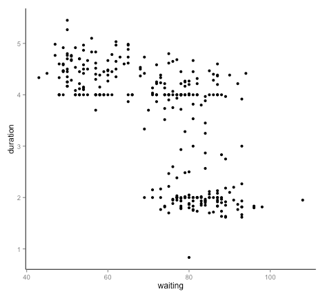

# Assignment 3

- Posting date: Jan. 29th 2015
- Due date: Feb 5th 2015, 1:59PM MST (it is due *by thursday's lecture*)
- Assignment name for `turnin`: `cs444_assignment_3`

# Description

In this assignment, you will use the SVG creation functions we
developed in the previous lecture to design a simple visualization for a dataset.

You will turn in an HTML file named `index.html`, together with any
other files you choose to create and reference. Each visualization
should be an SVG element of 500 pixels in both width and height. The
`id` of the element containing the first visualization should be
"scatterplot_1", and the `id` of the element containing the second
visualizations should be "scatterplot_2".

Note: for this assignment, you are *NOT* allowed to use any source
code other than the files we provide in links from this document.

## Provided source code

You can use the Javascript functions in the
[svg.js](assignment_3/svg.js) source file. These are the functions we
developed in class to create SVG elements, together with a helper
function for you to create RGB triplets (in order to give your
visualization data-driven colors)

## Dataset: ACT, GPA, SAT, oh my

This dataset ([ref](http://www.calvin.edu/~stob/data/)) contains
standardized scores for all Calvin College 2004 seniors that have
taken both the ACT and the SAT, together with their GPAs. There are
271 data points and 4 dimensions.

For your convenience, I have processed the original csv file into a
[Javascript source file](assignment_3/scores.js) that you can include directly in your submission.
The dataset looks like this:

    var scores = [
     { SATM:430, SATV:470, ACT:15, GPA: 2.239 },
     { SATM:560, SATV:350, ACT:16, GPA: 2.488 },
     { SATM:400, SATV:330, ACT:17, GPA: 2.982 },
     { SATM:410, SATV:450, ACT:17, GPA: 2.155 },
    ... 263 more rows ...
     { SATM:700, SATV:680, ACT:35, GPA: 3.911 },
     { SATM:720, SATV:770, ACT:35, GPA: 3.981 },
     { SATM:750, SATV:730, ACT:35, GPA: 3.882 },
     { SATM:790, SATV:780, ACT:35, GPA: 3.887 }
    ];

## Visualization 1 (90% credit)

Create a [scatterplot](http://en.wikipedia.org/wiki/Scatter_plot) of
SAT's mathematics scores (`SATM`) versus SAT's verbal scores
(`SATV`). In other words, the x coordinate of the plot should encode
the `SATM` variable, and the y coordinate should encode `SATV`. Use
the radius of the points to represent ACT scores, and color to
represent the GPA scores.

Notice that this specification is not exact: there are more than one
possible solution.  Together with the visualization, include no more
than two paragraphs of text describing how you designed the encodings.

## Visualization 2 (10% credit)

Think about the above specification for the visualizations: is it the
best way to portray the interesting features of the data? (Answer:
It's fine, but not ideal.)

Your goal for the second visualization is to improve on the first
one. We have not discussed perceptual principles in class yet, so you
do not need to give serious justifications for your choices. Still, I
want you to explore different variants and try to justify your decisions.

Together with the improved visualization, submit no more than two
paragraphs of text describing your changes and reason.

Hints:

- Visualization 1 used two related quantities for the X and Y axis. Is
there a way to combine them meaningfully?

- How helpful is the combination of the circle radius with circle
color? It might help to remember the discussion we had in class about
[preattentive processing](http://www.csc.ncsu.edu/faculty/healey/PP/).

- Visualization 1 suffers from some amount of overplotting. How would
you solve it? (*Overplotting* is what happens when the second shape
your draw goes entirely over the first shape. As a result, you cannot
tell if the first point was there to begin with, or, more generally,
how many points are "hiding")

## Extra credit (50% total)

(Yes, this is worth half of any future assignment)

Add axis lines, labels and tick marks to the X and Y axes of your
visualizations. In other words, to get extra credit, instead of looking like this:

your plots should look like this:

(Of course, the dataset I just used in the example above is not the
same as the one you have, so the values for the tick marks, labels,
etc. should all be different)
