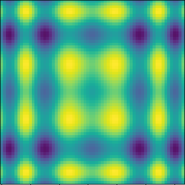
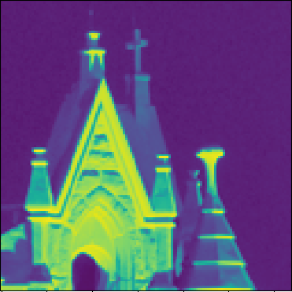
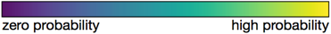

# Assignment 5

- Posting date: Mar 28th 2017
- Due date: Apr 11th 2017

# Metropolis Sampling

In this project, you will implement the Metropolis sampling algorithm
we discussed in class. Specifically, you will use it to generate
2D samples distributed according to the density of values described by
a 2D array.

You will turn in a short report describing your implementation (in the
programming language of your choice) and the results you obtained with
the datasets provided here.

Your program should take as input 2D arrays of positive real numbers
describing the density to be processed. These are provided here, as
CSV files.

* [Dataset 1](assignment_5/dataset1.csv) (64x64)
* [Dataset 2](assignment_5/dataset2.csv) (64x64)
* [Dataset 3](assignment_5/dataset3.csv) (128x128)

When displayed as colormapped images, the datasets look as follows:

## Part 1: show that samples are generated with the appropriate probability distribution

Show scatterplots of samples generated with your algorithm for each
dataset. For each dataset, show figures with samples of size 10, 100,
and 1000.

## Part 2: show that your choice of thinning parameter for the Markov Chain is appropriate

You need to choose the amount of *thinning* of your Markov Chain
carefully, in order to make sure that different samples that you
generate are (effectively) independent of one another. Experiment with
the amount of thinning, and show an example where the generated
samples do not appear to be independent of one another.

## Part 3: Describe the proposal distribution you used

There are many possible choices for the proposal distribution, and how
well it works depends on the dataset you use it with. Describe the
distribution you chose to use.
