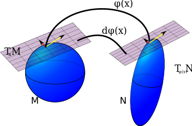

# [title: line-fit] Three short pieces on dimensionality reduction

Carlos Scheidegger Associate Professor, UA CS, HDC Lab

## Where I come from

  

    
    
    
    
    
    
    
    
    
    
    
    
    
    
    
    
    
    
    
    
    
    
    
    
  

  
 <!-- this is pretty gross.. -->
    <!-- 
https://cscheid.net
 -->
    
https://hdc.cs.arizona.edu

    <!-- 
cscheid@cs.arizona.edu
 -->
  

  

    
  <!--    -->
  <!--    -->
  <!--    -->
  

## This talk

* <https://cscheid.net/talks/2020-10-16> (I'm using Google Chrome)
* Three pieces on dimensionality reduction (DR):
  * DimReader
  * Deep Inverse
  * UMAP Tour

## [slide-data: backgroundImage ../tandon-march-2019/images/tsne/cnn_embed_6k.jpg] [title: line-fit bg-black] t-SNE plots are beautiful, but what are they showing us?

<a href="https://cs.stanford.edu/people/karpathy/cnnembed/cnn_embed_6k.jpg">https://cs.stanford.edu/people/karpathy/cnnembed/cnn_embed_6k.jpg</a>

## [slide-data: backgroundImage ../tandon-march-2019/images/tsne/cnn_embed_6k.jpg] 

Shouldn't our tools provide mechanisms for inspecting their own behavior?

## DimReader

* [Rebecca Faust, David Glickenstein, C.S., InfoVis 2018](http://cscheid.net/2018/09/29/dimreader-axis-lines-that-explain-nonlinear-projections.html)
* We give DR plots a new visual affordance: where will a point go if one of its attributes changes infinitesimally?

## A simple scatterplot

## t-SNE

t-SNE visualization 

## How: tangent maps

author: "User from reddit", CC BY 3.0

## How: Automatic Differentiation (autodiff)

* For many programs which produce values of functions, you can get derivatives for about the same effort as just computing thefunction value (!)
* The procedure is entirely synctatic, so a compiler can generate code that produces derivatives
* This is how pytorch and tensorflow work, and partly why neural nets are now so popular
* a [quick tutorial on autodiff](https://cscheid.net/writing/data_science/automatic_differentiation/index.html).

## Examples, Applications

## Examples, Applications

## 2: Deep Inverse

* (This is unpublished work by my student Mingwei Li - unpublished because it's too simple!)
* Same general setup: we have the result of a DR method and we want to "explain it"
* Here, we attempt to find a good "inverse": a mapping from projection back into input
* This allows us to interactively with the projection

## Deep Inverse, cont.

* Obviously no exact solution exists, so we minimize an error measure
* The mapping is given by a deep neural network
* The codebase is a ~300-line Python program and a simple Javascript front-end

## Demo

* [Digits dataset](http://hdc.cs.arizona.edu/~mwli/2d-generator/)
* [Fashion Items dataset](http://hdc.cs.arizona.edu/~mwli/2d-generator-fashion/)

## Why is this exciting?

* This technique is broadly applicable
* The space of UI interactions can be low dimensional (eg. a screen is only 2D)
* Low-dimensional domains are "easy" to learn
* Other stupid ML tricks: use this to hide latency from a slow server

## 3: UMAP Tour

* Finally, I want to demo what's currently possible with modern browser technology 
* We will use DR to understand the behavior of deep neural networks (the opposite of what we just did!)
* [Toward Comparing DNNs with UMAP Tour](https://tiga1231.github.io/umap-tour/), by Mingwei Li as well. He will be present this work next Monday.

## Thank you!

* I'm cscheid@email.arizona.edu
* I'll be spending the Fall and Spring working in the ANTARES project
* I'm looking forward to meeting all of you, even if COVID-19 won't let it be in person!
* Questions?
