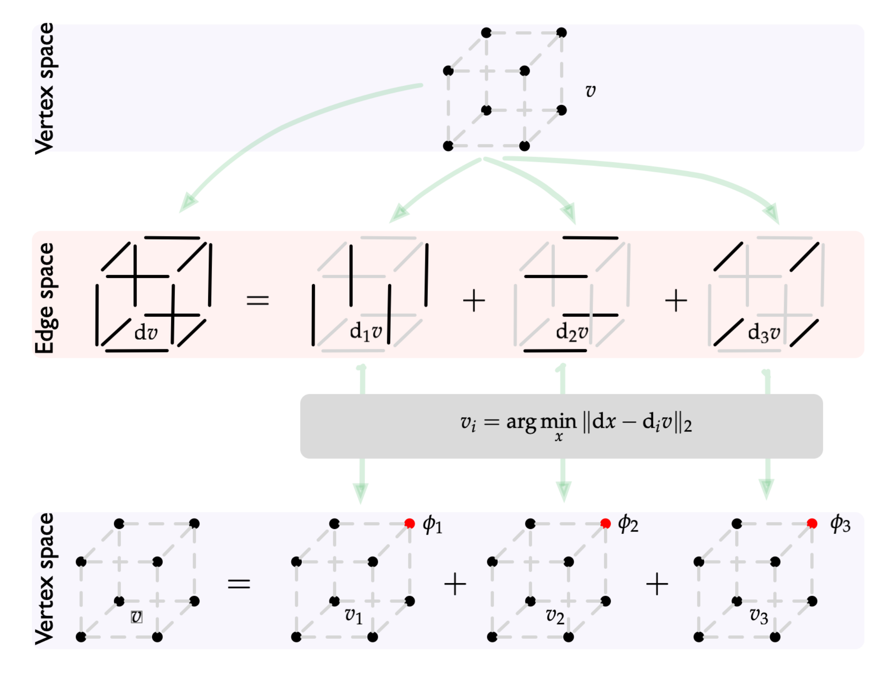

# [title: line-fit] Shapley, Grad, Fourier, and All That

Carlos Scheidegger, UA CS, HDC Lab

"The Band": Suresh Venkatasubramanian, Sorelle Friedler, ft. Lizzie Kumar (U. Utah, Haverford College)

## Credit in Cooperative Games

* Shapley Values assign credit to players in a cooperative game between $n$ players

* Typical example: Alice and Bob own a left-hand glove; Claire
  owns a right-hand glove. A pair is worth 1 dollar, but either hand
  by itself is worth nothing. How much should you offer each player to participate in the game?

## SV: two classic definitions

* Average marginal contribution over coalitions

  * $ \varphi_i(v) = \sum_{S \subset N \backslash \\{i\\} } \frac{\|S\|! (n - \|S\| - 1)!}{n} \left ( v(S \cup \\{i\\} ) - v(S) \right ) $
  
* Only functional that satisfies linearity, symmetry, and "efficiency"

  * Efficiency means "sum of shapley values equal value of the game for the full set of players"

## Shapley Values and ML Explanations

* Widely used in ML for feature importance explanations: "how important is gender for this health risk classifier"

* Define a game with one feature per player, define feature importance as the Shapley Value of player.

* **We think this is problematic on many grounds; this talk will offer a purely mathematical critique**.

## Some examples

1. $(0, 0, 0, 2)$: "everyone is needed"
2. $(0, 1, 1, 2)$: "ships passing in the night"
3. $(0, 10, 10, 2)$: "we're good but not good together"

* Shapley Values for all of these are the same: $(1, 1)$
* "Inessential games" are games where "players don't interact" (example 2).

## [title: line-fit] (S&T, 2017): Shapley from Gradients

Take the game on a hypercube, and define the gradient $\nabla$. 
Decompose $\nabla$ in $\nabla\_1, \dots, \nabla\_d$ such that $\sum_i \nabla_i = \nabla$.

## Grad: Shapley Values from Gradients
  
* Define one subgame per player

  $$\begin{eqnarray*}\tilde{v}_i &=& \textrm{argmin}_{u} || \nabla u - \nabla_i v ||_2\\v_i &=& \tilde{v}_i - \tilde{v}_i[\emptyset]\end{eqnarray*}$$
  
  The Shapley Value of $i$ in $v$ is $v\_i[U]$

## Proof $v_i[U]$ are Shapley Values

* $$\begin{eqnarray*}v_i &=& \nabla^\dagger \nabla_i v\\ \sum_i v_i &=& \nabla^\dagger \sum_i \nabla_i v \\ &=& \nabla^\dagger \nabla v\end{eqnarray*}$$
	
* $\nabla^\dagger \nabla\_i$ is a linear operator, and $\sum\_i v\_i[U] = v[U]$.
  
* Hence, $v \mapsto (v_1[U], \ldots, v_d[U])$ is linear, symmetric, and efficient.

## Fourier Transforms

* The FT on a hypercube converts between a representation of **function on sets** and a **multilinear polynomial**
  * "set" basis: weights are values of the game for each coalition
  * "polynomial" basis: weights are the coefficients for each multilinear monomial
* Takeaway 1 (easy): **a game is inessential iff its corresponding polynomial is strictly linear**
  * Shapley Values are only "complete" in inessential games!

## Fourier Transforms

* $${\small \begin{array}{cc} \begin{array}{ccc}\textrm{set}&\textrm{position}&\textrm{value} \\ \hline \{\} & (1, 1) & 0 \\ \{1\} & (-1, 1) & 1 \\ \{2\} & (1, -1) & 1 \\ \{1,2\} & (-1, -1) & 0 \end{array} & \begin{array}{cc}\textrm{monomial}&\textrm{coefficient} \\ \hline 1 & 1/2 \\ p_1 & -1/4 \\ p_2 & -1/4 \\ p_1p_2 & 1/2 \end{array} \end{array}}$$

* In set basis, $(0, 1, 1, 0)$
* $f(p_1, p_2) = 1/2 - 1/4 p_1 - 1/4 p_2 + 1/2 p_1 p_2$
* In polynomial basis, $(1/2, -1/4, -1/4, 1/2)$

## Fourier Transforms

* $${\small \begin{array}{cc} \begin{array}{ccc}\textrm{set}&\textrm{position}&\textrm{value} \\ \hline \{\} & (1, 1) & 0 \\ \{1\} & (-1, 1) & 1 \\ \{2\} & (1, -1) & 1 \\ \{1,2\} & (-1, -1) & 2 \end{array} & \begin{array}{cc}\textrm{monomial}&\textrm{coefficient} \\ \hline 1 & 1/2 \\ p_1 & -1/4 \\ p_2 & -1/4 \\ p_1p_2 & 0 \end{array} \end{array}}$$

* In set basis, $(0, 1, 1, 0)$
* $f(p_1, p_2) = 1/2 - 1/4 p_1 - 1/4 p_2$
* In polynomial basis, $(1/2, -1/4, -1/4, 0)$

## Now we analyze $\nabla^\dagger \nabla_i$

* $\dagger$ is the Moore-Penrose pseudo-inverse. We can analyze that operator via the "SVD" of $\nabla^\dagger \nabla_i$.

* Takeaway 2: there is an SVD decomposition of $\nabla = U \Sigma V^T$ such that $V$ is _precisely_ the Walsh-Hadamard matrix (and $U$ has $d-1$ copies of the WH matrix hidden inside it). $U$ decompose neatly into SVDs of $\nabla_i$ as well.

* This lets us push the gradient definition of SVs through the FTs

## Our result: a novel formula for SVs based on FTs

* Closed-form formula for Shapley Values from polynomial representation of the game.

* Shapley value for a player equals $-2 \times k$, where $k$ is the sum of all odd-degree coefficients of monomials containing that player, each divided by the degree of the monomial.

## Tying this back to ML explanations

* For 2-feature model with polynomial $c_1 1 + c_a a + c_b b + c_{ab} a b$, the Shapley value for player $a$ is $-2c_a$ (seems fine..?)

* For 3-feature model, Shapley value for player $a$ is $-2c_a - 2c_{abc}/3$ (oh oh.)

* Shapley Values are *weird*: there's no good reason that expression is a good summary of the feature importances.

## Speculation

* Where does the problem arise? 

* Our opinion: the axiom of *efficiency* makes sense in the context of cooperative games, but is pretty silly in feature importance explanations. We don't want _signed values_ to sum up to the total contribution: we want *magnitudes*.

* We think *orthogonality* is a much better choice, and leads to a much simpler "explanation": the FT representation itself!

## Thank you!

* Takeaways:

  1. A game is inessential iff its corresponding polynomial is strictly linear. Polynomials seem to be good explanations for feature importance games!

  2. There's a deep connection between SVs and FTs via $\nabla$ and its SVD

  3. SVs are very weird objects for ML feature importance explanations. Be skeptical of interpretation methods using them.

* Questions? (We're still working on the writeup...)

## References

* Broader critique of feature explanations and Shapley Values: Kumar et al, ICML 2019, arXiv:2002.11097
  
